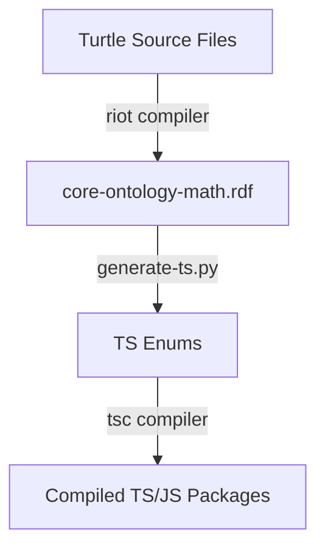

# Developer Setup & Repository Documentation

This document provides developer guidelines for setting up, building, and contributing to the **EduGraph Ontology** repository. 

For the core design rules, structural logic, and instructions on how to extend and manage the ontology itself (especially for the specialized agent in the online editor), see [DOCS_ONTOLOGY.md](file:///c:/Users/silen/Documents/EduGraph/edugraph-ontology/DOCS_ONTOLOGY.md).

---

## 1. Project Overview & Editing Methods

This repository contains the source definitions of the EduGraph core ontology, along with code generators to translate the ontology into client libraries.

### 1.1 Mapped Editing Workflows
- **Online Editor (Primary & Recommended)**: Official ontology edits should be performed using the specialized online editor. This editor is equipped with specialized tooling, including: 
  - simplified in-context editing capabilities 
  - sophisticated onology visualization and visual navigation
  - an AI agent designed for batch operations and thorough reviews following the rules in [DOCS_ONTOLOGY.md](file:///c:/Users/silen/Documents/EduGraph/edugraph-ontology/DOCS_ONTOLOGY.md).
- **Protégé (Convenience Exploration)**: The configuration files such as [catalog-v001.xml](file:///c:/Users/silen/Documents/EduGraph/edugraph-ontology/catalog-v001.xml) and related properties in the repository are provided as a convenience for developers who are accustomed to [Protégé](https://protege.stanford.edu/) and want to explore, visualize, or locally query the ontology using desktop tools.

---

## 2. Directory Structure

- **[.github/workflows/release.yml](file:///c:/Users/silen/Documents/EduGraph/edugraph-ontology/.github/workflows/release.yml)**: GitHub Action workflow executing automated compilation, versioning, and publishing of releases.
- **[src/ontology/generate-ts.py](file:///c:/Users/silen/Documents/EduGraph/edugraph-ontology/src/ontology/generate-ts.py)**: Python script utilizing `owlready2` to parse the compiled XML/RDF file and generate TypeScript enums.
- **[libraries/typescript/](file:///c:/Users/silen/Documents/EduGraph/edugraph-ontology/libraries/typescript/)**: Mapped package configuration for compiling the generated TypeScript into common distribution formats.
- **[core-schema.ttl](file:///c:/Users/silen/Documents/EduGraph/edugraph-ontology/core-schema.ttl)**: Core RDF schema defining OWL classes, structural properties, and progression properties.
- **[core-abilities.ttl](file:///c:/Users/silen/Documents/EduGraph/edugraph-ontology/core-abilities.ttl)**: Individuals belonging to the `Ability` class.
- **[core-areas-math.ttl](file:///c:/Users/silen/Documents/EduGraph/edugraph-ontology/core-areas-math.ttl)**: Individuals belonging to the `Area` class (Math taxonomy).
- **[core-scopes-math.ttl](file:///c:/Users/silen/Documents/EduGraph/edugraph-ontology/core-scopes-math.ttl)**: Individuals belonging to the `Scope` class (Math taxonomy).
- **[catalog-v001.xml](file:///c:/Users/silen/Documents/EduGraph/edugraph-ontology/catalog-v001.xml)**: XML Catalog mapping the online namespace to local Turtle files for Protégé.
- **[Dockerfile](file:///c:/Users/silen/Documents/EduGraph/edugraph-ontology/Dockerfile)**: Multi-stage build definition wrapping the compilers and code generator.
- **[pyproject.toml](file:///c:/Users/silen/Documents/EduGraph/edugraph-ontology/pyproject.toml)** & **[uv.lock](file:///c:/Users/silen/Documents/EduGraph/edugraph-ontology/uv.lock)**: Python project dependencies and locking definitions managed by the `uv` tool.

---

## 3. Build & Generation Pipeline

The generation of final ontology artifacts (XML/RDF files and compiled TypeScript definitions) is encapsulated in a multi-stage Docker build pipeline:



1. **Stage 1 (`ontology-formats`)**:
   - Downloads Apache Jena (v5.6.0).
   - Merges and compiles the source Turtle (`.ttl`) files into a single, unified XML/RDF format (`core-ontology-math.rdf`) using the Apache Jena `riot` tool:
     ```bash
     riot --output=RDF/XML core-schema.ttl core-abilities.ttl core-areas-math.ttl core-scopes-math.ttl > core-ontology-math.rdf
     ```
2. **Stage 2 (`python-code-gen`)**:
   - Sets up Python 3.13 via `astral-sh/uv`.
   - Runs [generate-ts.py](file:///c:/Users/silen/Documents/EduGraph/edugraph-ontology/src/ontology/generate-ts.py), which reads the compiled RDF, extracts individuals for `Area`, `Scope`, and `Ability`, and writes TypeScript enum mappings into `dist/typescript`.
3. **Stage 3 (`typescript-compiler`)**:
   - Installs node dependencies and runs `tsc` to compile TypeScript enums into `dist/` utilizing the package configurations.
4. **Stage 4 (`export`)**:
   - Outputs the compiled assets back to the host filesystem.

---

## 4. Local Development

### 4.1 Prerequisites
Ensure you have the following installed:
- Python (~=3.13.0) and [astral-sh/uv](https://github.com/astral-sh/uv)
- Docker Desktop (if building the full pipeline locally)
- Node.js (for compiling/testing TS libraries locally without Docker)

### 4.2 Local Python Code Generation
To setup the environment and trigger TypeScript enum generation locally:
```powershell
# Sync Python workspace dependencies
uv sync

# Run the TypeScript generator script (requires core-ontology-math.rdf to be present)
uv run src/ontology/generate-ts.py
```

### 4.3 Compiling via Docker
To run the full compilation pipeline and output the generated distribution files to your local `dist/` directory:
```powershell
docker build . --output dist
```

---

## 5. CI/CD & Release Workflow

The automated build and publish pipeline is defined in [.github/workflows/release.yml](file:///c:/Users/silen/Documents/EduGraph/edugraph-ontology/.github/workflows/release.yml).

### 5.1 Trigger Rules
- **Releases:** Triggered on Git tags matching `v*.*.*`. The package version is set to the exact tag value (e.g., `1.0.0`).
- **Previews:** Triggered on any push to the `main` branch. The pre-release version is generated using the format `0.0.0-pre.<short-commit-sha>` (e.g., `0.0.0-pre.ab12cd34ef56`).

### 5.2 Release Assets
The release job uploads the following files as assets to the Github Release:
- **Ontology Files**: `core-schema.ttl`, `core-abilities.ttl`, `core-areas-math.ttl`, `core-scopes-math.ttl`, and `core-ontology-math.rdf`.
- **TypeScript Package**: `edugraph-ts.tgz` (a tarball containing the compiled JS/TS client libraries).
