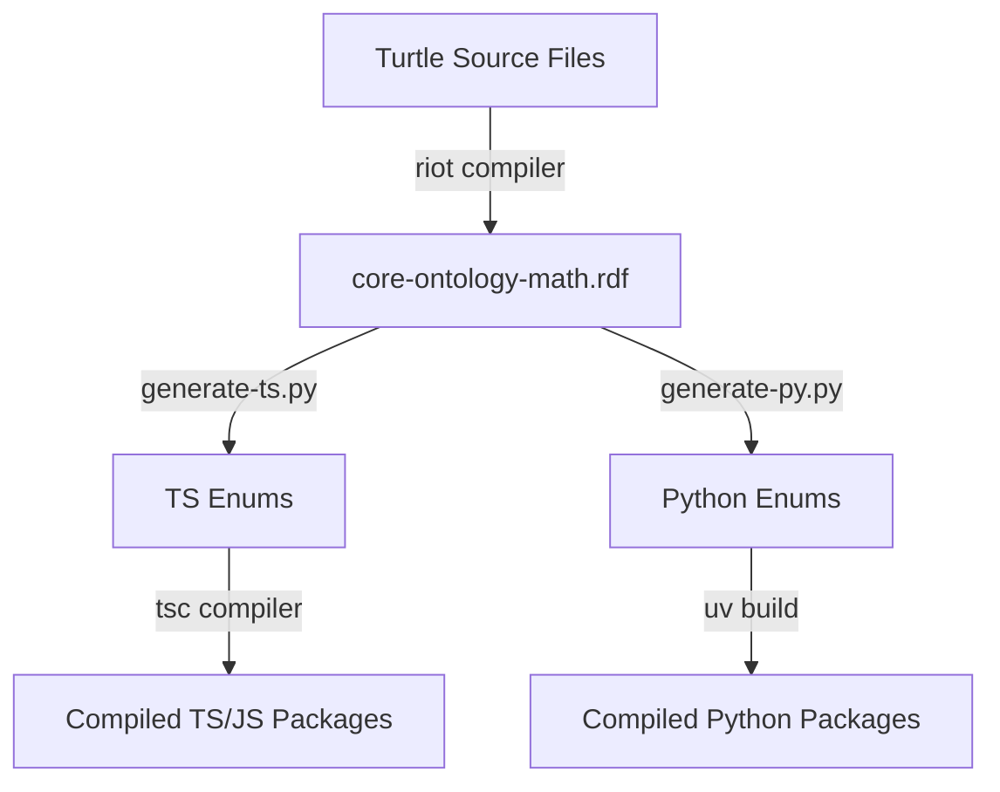

# Developer Setup & Repository Documentation

This document provides developer guidelines for setting up, building, and contributing to the **EduGraph Ontology** repository. 

For the core design rules, structural logic, and instructions on how to extend and manage the ontology itself (especially for the specialized agent in the online editor), see [DOCS_ONTOLOGY.md](file:///c:/Users/silen/Documents/EduGraph/edugraph-ontology/DOCS_ONTOLOGY.md).

---

## 1. Project Overview & Editing Methods

This repository contains the source definitions of the EduGraph core ontology, along with code generators to translate the ontology into client libraries.

### 1.1 Mapped Editing Workflows
- **Online Editor (Primary & Recommended)**: Official ontology edits should be performed using the specialized online editor. This editor is equipped with specialized tooling, including: 
  - simplified in-context editing capabilities 
  - sophisticated onology visualization and visual navigation
  - an AI agent designed for batch operations and thorough reviews following the rules in [DOCS_ONTOLOGY.md](file:///c:/Users/silen/Documents/EduGraph/edugraph-ontology/DOCS_ONTOLOGY.md).
- **Protégé (Convenience Exploration)**: The configuration files such as [catalog-v001.xml](file:///c:/Users/silen/Documents/EduGraph/edugraph-ontology/catalog-v001.xml) and related properties in the repository are provided as a convenience for developers who are accustomed to [Protégé](https://protege.stanford.edu/) and want to explore, visualize, or locally query the ontology using desktop tools.

---

## 2. Directory Structure

- **[.github/workflows/release.yml](file:///c:/Users/silen/Documents/EduGraph/edugraph-ontology/.github/workflows/release.yml)**: GitHub Action workflow executing automated compilation, versioning, and publishing of releases.
- **[src/ontology/generate-ts.py](file:///c:/Users/silen/Documents/EduGraph/edugraph-ontology/src/ontology/generate-ts.py)**: Python script utilizing `owlready2` to parse the compiled XML/RDF file and generate TypeScript enums.
- **[src/ontology/generate-py.py](file:///c:/Users/silen/Documents/EduGraph/edugraph-ontology/src/ontology/generate-py.py)**: Python script utilizing `owlready2` to parse the compiled XML/RDF file and generate Python enums.
- **[libraries/typescript/](file:///c:/Users/silen/Documents/EduGraph/edugraph-ontology/libraries/typescript/)**: Mapped package configuration for compiling the generated TypeScript into common distribution formats.
- **[libraries/python/](file:///c:/Users/silen/Documents/EduGraph/edugraph-ontology/libraries/python/)**: Mapped package configuration for packaging the generated Python enums into wheel and source distribution formats.
- **[core-schema.ttl](file:///c:/Users/silen/Documents/EduGraph/edugraph-ontology/core-schema.ttl)**: Core RDF schema defining OWL classes, structural properties, and progression properties.
- **[core-abilities.ttl](file:///c:/Users/silen/Documents/EduGraph/edugraph-ontology/core-abilities.ttl)**: Individuals belonging to the `Ability` class.
- **[core-areas-math.ttl](file:///c:/Users/silen/Documents/EduGraph/edugraph-ontology/core-areas-math.ttl)**: Individuals belonging to the `Area` class (Math taxonomy).
- **[core-scopes-math.ttl](file:///c:/Users/silen/Documents/EduGraph/edugraph-ontology/core-scopes-math.ttl)**: Individuals belonging to the `Scope` class (Math taxonomy).
- **[catalog-v001.xml](file:///c:/Users/silen/Documents/EduGraph/edugraph-ontology/catalog-v001.xml)**: XML Catalog mapping the online namespace to local Turtle files for Protégé.
- **[Dockerfile](file:///c:/Users/silen/Documents/EduGraph/edugraph-ontology/Dockerfile)**: Multi-stage build definition wrapping the compilers and code generator.
- **[pyproject.toml](file:///c:/Users/silen/Documents/EduGraph/edugraph-ontology/pyproject.toml)** & **[uv.lock](file:///c:/Users/silen/Documents/EduGraph/edugraph-ontology/uv.lock)**: Python project dependencies and locking definitions managed by the `uv` tool.

---

## 3. Build & Generation Pipeline

The generation of final ontology artifacts (XML/RDF files and compiled TypeScript definitions) is encapsulated in a multi-stage Docker build pipeline:



1. **Stage 1 (`ontology-formats`)**:
   - Downloads Apache Jena (v5.6.0).
   - Merges and compiles the source Turtle (`.ttl`) files into a single, unified XML/RDF format (`core-ontology-math.rdf`) using the Apache Jena `riot` tool:
     ```bash
     riot --output=RDF/XML core-schema.ttl core-abilities.ttl core-areas-math.ttl core-scopes-math.ttl > core-ontology-math.rdf
     ```
2. **Stage 2 (`python-code-gen`)**:
   - Sets up Python 3.13 via `astral-sh/uv`.
   - Runs [generate-ts.py](file:///c:/Users/silen/Documents/EduGraph/edugraph-ontology/src/ontology/generate-ts.py) and [generate-py.py](file:///c:/Users/silen/Documents/EduGraph/edugraph-ontology/src/ontology/generate-py.py), which read the compiled RDF, extract individuals for `Area`, `Scope`, and `Ability`, and write enum mappings into `dist/typescript` and `dist/python/src/edugraph` respectively.
3. **Stage 3 (`typescript-compiler`)**:
   - Installs node dependencies and runs `tsc` to compile TypeScript enums into `dist/` utilizing the package configurations.
4. **Stage 4 (`python-builder`)**:
   - Updates the version using the `PACKAGE_VERSION` build argument and runs `uv build` to package the generated Python enums into a `.whl` and `.tar.gz` archive.
5. **Stage 5 (`export`)**:
   - Outputs the compiled assets (TypeScript and Python distribution files) back to the host filesystem.

---

## 4. Local Development

### 4.1 Prerequisites
Ensure you have the following installed:
- Python (~=3.13.0) and [astral-sh/uv](https://github.com/astral-sh/uv)
- Docker Desktop (if building the full pipeline locally)
- Node.js (for compiling/testing TS libraries locally without Docker)

### 4.2 Local Python Code Generation
To setup the environment and trigger TypeScript and Python enum generation locally:
```powershell
# Sync Python workspace dependencies
uv sync

# Run the TypeScript generator script (requires core-ontology-math.rdf to be present)
uv run src/ontology/generate-ts.py

# Run the Python generator script (requires core-ontology-math.rdf to be present)
uv run src/ontology/generate-py.py
```

### 4.3 Compiling via Docker
To run the full compilation pipeline and output the generated distribution files to your local `dist/` directory:
```powershell
docker build . --output dist
```

---

## 5. CI/CD & Release Workflow

The automated build and publish pipeline is defined in [.github/workflows/release.yml](file:///c:/Users/silen/Documents/EduGraph/edugraph-ontology/.github/workflows/release.yml).

### 5.1 Trigger Rules
- **Releases:** Triggered on Git tags matching `v*.*.*`. The package version is set to the exact tag value (e.g., `1.0.0`).
- **Previews:** Triggered on any push to the `main` branch. The pre-release version is generated using the format `0.0.0-pre.<short-commit-sha>` (e.g., `0.0.0-pre.ab12cd34ef56`).

### 5.2 Release Assets
The release job uploads the following files as assets to the Github Release:
- **Ontology Files**: `core-schema.ttl`, `core-abilities.ttl`, `core-areas-math.ttl`, `core-scopes-math.ttl`, and `core-ontology-math.rdf`.
- **TypeScript Package**: `edugraph-ts.tgz` (a tarball containing the compiled JS/TS client libraries).

---

## 6. Client Libraries API & Relations Usage

Both the TypeScript and Python client libraries expose the core taxonomic and progression relationships defined in the ontology.

### 6.1 TypeScript API Usage

```typescript
import { Area, relations, partOfTransitive, expands, definition } from "edugraph-ts";

// 1. Direct definition lookup (JSDoc also pops up on Area.AbsoluteValue in IDE)
const def1 = definition(Area.AbsoluteValue);
// def1 is: "The magnitude of a number without regard to its sign..."
const def2 = relations(Area.AbsoluteValue).definition; // Also accessible on the relations object

// 2. Direct relations lookup
const absValRelations = relations(Area.AbsoluteValue);
// absValRelations is: { definition: "...", expands: [...], partOf: [...], translates: [...] }
const isPartOfEvaluation = absValRelations.partOf?.includes(Area.ArithmeticEvaluation); // true

// 3. Direct helper functions
const absoluteExpands = expands(Area.AbsoluteValue); // [Area.IntegerSigns, Area.ZeroConcept]

// 4. Transitive helper functions (BFS closure traversal)
// Traverses: AbsoluteValue -> ArithmeticEvaluation -> Arithmetic
const transitiveParents = partOfTransitive(Area.AbsoluteValue);
const includesArithmetic = transitiveParents.includes(Area.Arithmetic); // true
```

### 6.2 Python API Usage

The Python library follows standard PEP 8 snake_case naming conventions for relationship helper functions.

```python
from edugraph import Area, relations, part_of_transitive, expands, definition

# 1. Direct definition lookup (PEP 258 docstring also displays on Area.AbsoluteValue in IDE)
# Property access on enum member
def1 = Area.AbsoluteValue.definition 
# def1 is: "The magnitude of a number without regard to its sign..."

# Helper function access
def2 = definition(Area.AbsoluteValue)

# 2. Direct relations lookup
abs_val_relations = relations(Area.AbsoluteValue)
# abs_val_relations is a TypedDict matching:
# {"definition": "...", "expands": [...], "partOf": [...], "translates": [...]}
is_part_of_evaluation = Area.ArithmeticEvaluation in abs_val_relations.get("partOf", [])  # True

# 3. Direct helper functions
absolute_expands = expands(Area.AbsoluteValue)  # [Area.IntegerSigns, Area.ZeroConcept]

# 4. Transitive helper functions (BFS closure traversal)
# Traverses: AbsoluteValue -> ArithmeticEvaluation -> Arithmetic
transitive_parents = part_of_transitive(Area.AbsoluteValue)
includes_arithmetic = Area.Arithmetic in transitive_parents  # True
```

### 6.3 Relation Properties Mapping Reference

The following relation properties are supported:

| RDF Object Property | TS Direct Helper | TS Transitive Helper | Python Direct Helper | Python Transitive Helper | Description |
|---|---|---|---|---|---|
| `partOf` | `partOf` | `partOfTransitive` | `part_of` | `part_of_transitive` | Taxonomic parent relationship |
| `hasPart` | `hasPart` | `hasPartTransitive` | `has_part` | `has_part_transitive` | Taxonomic children relationship |
| `expands` | `expands` | `expandsTransitive` | `expands` | `expands_transitive` | Progression expansion relationship |
| `expandedBy` | `expandedBy` | `expandedByTransitive` | `expanded_by` | `expanded_by_transitive` | Progression expanded relationship |
| `integrates` | `integrates` | `integratesTransitive` | `integrates` | `integrates_transitive` | Progression composition relationship |
| `integratedBy` | `integratedBy` | `integratedByTransitive` | `integrated_by` | `integrated_by_transitive` | Progression integrated relationship |
| `inverts` | `inverts` | `invertsTransitive` | `inverts` | `inverts_transitive` | Logical inverse relationship (subproperty of expands) |
| `invertedBy` | `invertedBy` | `invertedByTransitive` | `inverted_by` | `inverted_by_transitive` | Inverse of logical inverse (subproperty of expandedBy) |
| `translates` | `translates` | `translatesTransitive` | `translates` | `translates_transitive` | Logical visualization translation (subproperty of integrates) |
| `translatedBy` | `translatedBy` | `translatedByTransitive` | `translated_by` | `translated_by_transitive` | Inverse of logical translation (subproperty of integratedBy) |

### 6.4 Deduction Helpers: Capabilities vs. Boundaries

Both libraries expose a dual pair of deduction helpers built on the `implies` and `contradicts` chains. The rule of thumb: **capabilities are declared with `deductCompatible`, boundaries with `deductAdmitting`** — capability lists say what is inside the fence, boundary lists say what can reach over it.

- **`deductCompatible(constraints)`** (Python: `deduct_compatible`) — the containment operator. Returns all labels guaranteed to stay within the window spanned by the given constraints: labels at least as strict as one of the constraints and satisfiable with all of them. Constraints compose conjunctively (more constraints → smaller set). Use it to declare what a component *can handle*, e.g. a generator supporting numbers within (0, 20):

  ```typescript
  deductCompatible([Scope.NumbersLargerZero, Scope.NumbersSmaller20])
  // → [NumbersLargerZero, NumbersLarger10, NumbersSmaller10, NumbersSmaller20]
  ```

- **`deductAdmitting(boundaries)`** (Python: `deduct_admitting`) — the reachability operator. Returns all labels that *admit* content crossing any of the given boundaries: the boundary and every label implying it (content must cross the line) plus the weakenings of the boundary's contradiction partners (bounds loose enough that content may cross the line). Boundaries compose disjunctively (more boundaries → larger set). Use it to declare what a component *must reject*, e.g. a view that cannot render numbers beyond 10:

  ```typescript
  deductAdmitting([Scope.NumbersLarger10])
  // → [NumbersLarger10 … NumbersLarger1000000, NumbersSmaller20 … NumbersSmaller1000000]
  // Spared: NumbersSmaller10 (guarantees safety), NumbersLargerZero (pure lower bound)
  ```

  A band-limited component rejects both directions with one call: `deductAdmitting([Scope.NumbersLarger100, Scope.NumbersSmaller10])`.

Note that a pure lower-bound label (e.g. `NumbersLargerZero`) is never returned by `deductAdmitting` for an upper boundary: rejection lists are evaluated per label, and a lower bound only exceeds a capacity in conjunction with a loose upper bound — which triggers the rejection by itself.

#### Satisfiability Primitive

Both deduction helpers are built on a shared satisfiability check, also exported for direct use:

- **`incompatible(a, b)`** (Python: `incompatible`) — returns `true` when two labels cannot be jointly satisfied: some label in `a`'s `implies` closure contradicts some label in `b`'s `implies` closure. This composition is necessary because `contradictsTransitive` alone only closes over contradiction edges and misses far-apart unsatisfiable pairs — e.g. `NumbersSmaller10` and `NumbersLarger100` have no direct contradiction edge, but `NumbersSmaller10` implies `NumbersSmaller100`, which contradicts `NumbersLarger100`. Prefer `incompatible` over ad hoc `contradictsTransitive` checks whenever satisfiability (not just direct/transitive contradiction) is the actual question.

Internally, `deductCompatible` and `deductAdmitting` also rely on `isBoundTyped` (not exported) to decide whether a constraint should traverse `impliedByTransitive` (bound-typed labels, whose implication family contains a contradiction edge, e.g. `NumbersSmaller20`) or `impliesTransitive` (contradiction-free labels, e.g. `Area.Addition`). This replaced an earlier implementation that matched on the substrings `"Smaller"`/`"Larger"` in the label name — `isBoundTyped` is derived purely from the relation graph and generalizes to any future bound-typed dimension without a source-code change.
