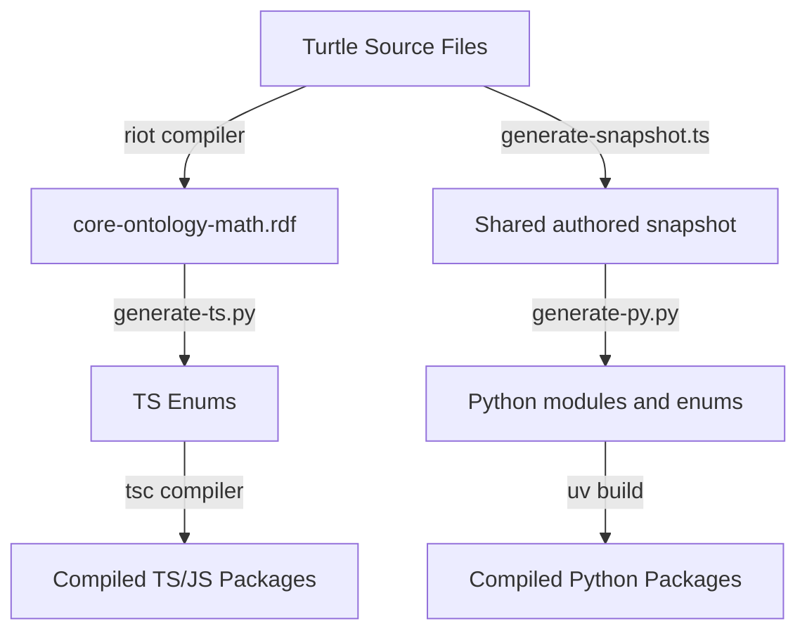

# Developer Setup & Repository Documentation

This document provides developer guidelines for setting up, building, and contributing to the **EduGraph Ontology** repository. 

For ontology authoring and review, use the [development references](docs/README.md).
They provide focused rules, examples, and checklists for humans and agents. This document covers
the repository tooling and generated APIs.

---

## 1. Project Overview & Editing Methods

This repository contains the source definitions of the EduGraph core ontology, along with code generators to translate the ontology into client libraries.

### 1.1 Mapped Editing Workflows
- **Online Editor (Primary & Recommended)**: Official ontology edits should be performed using the specialized online editor. This editor is equipped with specialized tooling, including: 
  - simplified in-context editing capabilities 
  - sophisticated onology visualization and visual navigation
  - an AI agent designed for batch operations and reviews using the relevant [ontology references](docs/README.md).
- **Protégé (Convenience Exploration)**: The configuration files such as [catalog-v001.xml](catalog-v001.xml) and related properties in the repository are provided as a convenience for developers who are accustomed to [Protégé](https://protege.stanford.edu/) and want to explore, visualize, or locally query the ontology using desktop tools.

---

## 2. Directory Structure

- **[docs/](docs/README.md)**: Ontology authoring rules, review workflow, annotation and model guidance, and consolidation tracking.
- **[.github/workflows/release.yml](.github/workflows/release.yml)**: GitHub Action workflow executing automated compilation, versioning, and publishing of releases.
- **[src/ontology/generate-ts.py](src/ontology/generate-ts.py)**: Python script utilizing `owlready2` to parse the compiled XML/RDF file and generate TypeScript enums.
- **[src/ontology/generate-py.py](src/ontology/generate-py.py)**: Python assembler generating typed enums from the shared authored JSON snapshot and copying maintained runtime modules.
- **[libraries/typescript/](libraries/typescript/)**: Mapped package configuration for compiling the generated TypeScript into common distribution formats.
- **[libraries/python/](libraries/python/)**: Mapped package configuration for packaging the generated Python enums into wheel and source distribution formats.
- **[core-schema.ttl](core-schema.ttl)**: Core RDF schema defining OWL classes, structural properties, and progression properties.
- **[core-abilities.ttl](core-abilities.ttl)**: Individuals belonging to the `Ability` class.
- **[core-areas-math.ttl](core-areas-math.ttl)**: Individuals belonging to the `Area` class (Math taxonomy).
- **[core-scopes-math.ttl](core-scopes-math.ttl)**: Individuals belonging to the `Scope` class (Math taxonomy).
- **[catalog-v001.xml](catalog-v001.xml)**: XML Catalog mapping the online namespace to local Turtle files for Protégé.
- **[Dockerfile](Dockerfile)**: Multi-stage build definition wrapping the compilers and code generator.
- **[pyproject.toml](pyproject.toml)** & **[uv.lock](uv.lock)**: Python project dependencies and locking definitions managed by the `uv` tool.

---

## 3. Build & Generation Pipeline

The generation of final ontology artifacts (XML/RDF files and compiled TypeScript definitions) is encapsulated in a multi-stage Docker build pipeline:


```mermaid
graph TD
    TTL[Turtle Source Files] -->|riot compiler| RDF[core-ontology-math.rdf]
    RDF -->|generate-ts.py| TS[TS Enums]
    TS -->|tsc compiler| JS[Compiled TS/JS Packages]
    TTL -->|generate-snapshot.ts| JSON[Shared authored snapshot]
    JSON -->|generate-py.py| PY[Python modules and enums]
    PY -->|uv build| WHL[Compiled Python Packages]
```

1. **Stage 1 (`ontology-formats`)**:
   - Downloads Apache Jena (v5.6.0).
   - Merges and compiles the source Turtle (`.ttl`) files into a single, unified XML/RDF format (`core-ontology-math.rdf`) using the Apache Jena `riot` tool:
     ```bash
     riot --output=RDF/XML core-schema.ttl core-abilities.ttl core-areas-math.ttl core-scopes-math.ttl > core-ontology-math.rdf
     ```
2. **Stage 2 (`python-code-gen`)**:
   - Sets up Python 3.13 via `astral-sh/uv`.
   - Runs [generate-ts.py](src/ontology/generate-ts.py) to extract TypeScript enums from the compiled RDF. TypeScript relation helpers are maintained adapters over the shared core; a separate bootstrap step generates its bundled snapshot from authored Turtle.
3. **Stage 3 (`typescript-compiler`)**:
   - Installs node dependencies, compiles the generated TypeScript with `tsc`, runs the client
     relation tests, validates the ontology source rules, and checks documentation references.
4. **Stage 4 (`python-builder`)**:
   - Assembles maintained Python modules and enums from the shared authored JSON snapshot, maps `PACKAGE_VERSION` to PEP 440, runs strict typing/lint, conformance and client tests, and builds/verifies wheel and sdist consumers. The optional parser is included in test environments; core runtime dependencies remain empty.
5. **Stage 5 (`export`)**:
   - Outputs the compiled assets (TypeScript and Python distribution files) back to the host filesystem.

---

## 4. Local Development

### 4.1 Prerequisites
Ensure you have the following installed:
- Python (~=3.13.0) and [astral-sh/uv](https://github.com/astral-sh/uv)
- Docker Desktop (if building the full pipeline locally)
- Node.js (for compiling/testing TS libraries locally without Docker)

### 4.2 Local Python Code Generation
To setup the environment and trigger TypeScript and Python enum generation locally:
```powershell
# Sync Python workspace dependencies
uv sync

# Run the TypeScript generator script (requires core-ontology-math.rdf to be present)
uv run src/ontology/generate-ts.py

# Run the Python generator script (requires core-ontology-math.rdf to be present)
uv run src/ontology/generate-py.py # requires dist/typescript/snapshot.json from the build
```

### 4.3 Compiling via Docker
To run the full compilation pipeline and output the generated distribution files to your local `dist/` directory:
```powershell
docker build . --output dist
```

This is the authoritative local gate. It includes the TypeScript ontology validators and the
mechanical documentation checks described in the
[algorithmic check inventory](docs/plan/automated-rule-checks.md). The same validation functions
are exported by `edugraph-ts` for editor integration.

---

## 5. CI/CD & Release Workflow

The automated build and publish pipeline is defined in [.github/workflows/release.yml](.github/workflows/release.yml).

### 5.1 Trigger Rules
- **Releases:** Triggered on Git tags matching `v*.*.*`. The package version is set to the exact tag value (e.g., `1.0.0`).
- **Previews:** Triggered on any push to the `main` branch. The pre-release version is generated using the format `0.0.0-pre.<short-commit-sha>` (e.g., `0.0.0-pre.ab12cd34ef56`).

### 5.2 Release Assets
The release job uploads the following files as assets to the Github Release:
- **Ontology Files**: `core-schema.ttl`, `core-abilities.ttl`, `core-areas-math.ttl`, `core-scopes-math.ttl`, and `core-ontology-math.rdf`.
- **TypeScript Package**: `edugraph-ts.tgz` (a tarball containing the compiled JS/TS client libraries).
- **Python Package**: A wheel and source distribution containing the generated Python client library.

---

## 6. Client Libraries API & Relations Usage

Both the TypeScript and Python client libraries expose the structural, specialization, and progression relationships defined in the ontology.
Ontology validation is implemented only in the TypeScript library so the repository and ontology
editor can use the same rules. Python provides descriptor and relation queries over released or supplied snapshots.

### 6.1 TypeScript API Usage

```typescript
import { Area, Scope, relations, specializesTransitive, structuresTransitive, expands, definition } from "edugraph-ts";

// 1. Direct definition lookup (JSDoc also pops up on Area.AbsoluteNumberMagnitude in IDE)
const def1 = definition(Area.AbsoluteNumberMagnitude);
// def1 is: "The nonnegative magnitude of a rational number independently of its sign..."
const def2 = relations(Area.AbsoluteNumberMagnitude).definition; // Also accessible on the relations object

// 2. Direct relations lookup
const squareRelations = relations(Area.Square);
const isRectangle = squareRelations.specializes?.includes(Area.Rectangle); // true

// 3. Direct helper functions
const signExpands = expands(Area.SignNotation); // [Area.AbsoluteNumberMagnitude, Area.ZeroConcept]

// 4. Transitive helper functions (BFS closure traversal)
// Specialization inheritance only: Square -> Rectangle -> Parallelogram -> Quadrilateral -> Polygon
const inheritedCapabilities = specializesTransitive(Area.Square);
const includesPolygon = inheritedCapabilities.includes(Area.Polygon); // true

// Combined structural navigation: MeterScale -> MetricDistanceScale -> DistanceAbstraction
const structuralContext = structuresTransitive(Scope.MeterScale);
const includesDistance = structuralContext.includes(Scope.DistanceAbstraction); // true
```

### 6.2 Python API Usage

The Python library follows standard PEP 8 snake_case naming conventions for relationship helper functions.

```python
from edugraph import Area, Scope, relations, specializes_transitive, structures_transitive, expands, definition

# 1. Direct definition lookup (PEP 258 docstring also displays on Area.AbsoluteNumberMagnitude in IDE)
# Property access on enum member
def1 = Area.AbsoluteNumberMagnitude.definition
# def1 is: "The nonnegative magnitude of a rational number independently of its sign..."

# Helper function access
def2 = definition(Area.AbsoluteNumberMagnitude)

# 2. Direct relations lookup
square_relations = relations(Area.Square)
# square_relations is a TypedDict matching:
# {"definition": "...", "specializes": [...], "structures": [...]}
is_rectangle = Area.Rectangle in square_relations.get("specializes", [])  # True

# 3. Direct helper functions
sign_expands = expands(Area.SignNotation)  # [Area.AbsoluteNumberMagnitude, Area.ZeroConcept]

# 4. Transitive helper functions (BFS closure traversal)
# Specialization inheritance only
inherited_capabilities = specializes_transitive(Area.Square)
includes_polygon = Area.Polygon in inherited_capabilities  # True

# Combined structural navigation
structural_context = structures_transitive(Scope.MeterScale)
includes_distance = Scope.DistanceAbstraction in structural_context  # True
```

### 6.3 Relation Properties Mapping Reference

The following relation properties are supported:

| RDF Object Property | TS Direct Helper | TS Transitive Helper | Python Direct Helper | Python Transitive Helper | Description |
|---|---|---|---|---|---|
| `structures` | `structures` | `structuresTransitive` | `structures` | `structures_transitive` | Combined structural parent relationship |
| `structuredBy` | `structuredBy` | `structuredByTransitive` | `structured_by` | `structured_by_transitive` | Inverse combined structural relationship |
| `partOf` | `partOf` | `partOfTransitive` | `part_of` | `part_of_transitive` | Non-inheriting constituent-to-whole relationship |
| `hasPart` | `hasPart` | `hasPartTransitive` | `has_part` | `has_part_transitive` | Inverse whole-to-constituent relationship |
| `specializes` | `specializes` | `specializesTransitive` | `specializes` | `specializes_transitive` | Inheriting narrower-to-broader relationship |
| `specializedBy` | `specializedBy` | `specializedByTransitive` | `specialized_by` | `specialized_by_transitive` | Inverse broader-to-narrower relationship |
| `expands` | `expands` | `expandsTransitive` | `expands` | `expands_transitive` | Progression expansion relationship |
| `expandedBy` | `expandedBy` | `expandedByTransitive` | `expanded_by` | `expanded_by_transitive` | Progression expanded relationship |
| `integrates` | `integrates` | `integratesTransitive` | `integrates` | `integrates_transitive` | Progression composition relationship |
| `integratedBy` | `integratedBy` | `integratedByTransitive` | `integrated_by` | `integrated_by_transitive` | Progression integrated relationship |
| `inverts` | `inverts` | `invertsTransitive` | `inverts` | `inverts_transitive` | Logical inverse relationship (subproperty of expands) |
| `invertedBy` | `invertedBy` | `invertedByTransitive` | `inverted_by` | `inverted_by_transitive` | Inverse of logical inverse (subproperty of expandedBy) |
| `translates` | `translates` | `translatesTransitive` | `translates` | `translates_transitive` | Logical visualization translation (subproperty of integrates) |
| `translatedBy` | `translatedBy` | `translatedByTransitive` | `translated_by` | `translated_by_transitive` | Inverse of logical translation (subproperty of integratedBy) |

### 6.4 Deduction Helpers: Constraint Expansion

Both libraries expose deduction helpers built on the `implies` and `contradicts` chains.
They compute label sets from the recorded constraint relations. They do not inspect content or
establish that every returned label is simultaneously true of it.

- **`deductCompatible(constraints)`** (Python: `deduct_compatible`) — the containment operator. Returns all labels guaranteed to stay within the window spanned by the given constraints: labels at least as strict as one of the constraints and satisfiable with all of them. Constraints compose conjunctively (more constraints → smaller set). For example, the recorded relations produce this set for two numeric constraints:

  ```typescript
  deductCompatible([Scope.NumbersLargerZero, Scope.NumbersSmaller20])
  // → [NumbersLargerZero, NumbersLarger10, NumbersSmaller10, NumbersSmaller20]
  ```

- **`deductAdmitting(boundaries)`** (Python: `deduct_admitting`) — the reachability operator. Returns all labels that *admit* content crossing any of the given boundaries: the boundary and every label implying it (content must cross the line) plus the weakenings of the boundary's contradiction partners (bounds loose enough that content may cross the line). Boundaries compose disjunctively (more boundaries → larger set). For example, expanding the `NumbersLarger10` boundary gives:

  ```typescript
  deductAdmitting([Scope.NumbersLarger10])
  // → [NumbersLarger10 … NumbersLarger1000000, NumbersSmaller20 … NumbersSmaller1000000]
  // Not returned: NumbersSmaller10 (declared contradiction), NumbersLargerZero (pure lower bound)
  ```

  Multiple boundaries can be supplied in one call: `deductAdmitting([Scope.NumbersLarger100, Scope.NumbersSmaller10])`.

For an upper boundary such as `NumbersLarger10`, `deductAdmitting` does not return the pure
lower-bound label `NumbersLargerZero`. This helper follows recorded implication and contradiction
paths; it is not a general numerical solver. Interpret its results against the definitions and
relations, including the [numeric-boundary review](docs/plan/ontology-consolidation.md#2-reconcile-numeric-boundary-definitions-and-contradictions).

#### Satisfiability Primitive

Both deduction helpers are built on a shared satisfiability check, also exported for direct use:

- **`incompatible(a, b)`** (Python: `incompatible`) — returns `true` when two labels cannot be jointly satisfied: some label in `a`'s `implies` closure contradicts some label in `b`'s `implies` closure. This composition is necessary because `contradictsTransitive` alone only closes over contradiction edges and misses far-apart unsatisfiable pairs — e.g. `NumbersSmaller10` and `NumbersLarger100` have no direct contradiction edge, but `NumbersSmaller10` implies `NumbersSmaller100`, which contradicts `NumbersLarger100`. Prefer `incompatible` over ad hoc `contradictsTransitive` checks whenever satisfiability (not just direct/transitive contradiction) is the actual question.

Internally, `deductCompatible` and `deductAdmitting` also rely on `isBoundTyped` (not exported) to decide whether a constraint should traverse `impliedByTransitive` (bound-typed labels, whose implication family contains a contradiction edge, e.g. `NumbersSmaller20`) or `impliesTransitive` (contradiction-free labels, e.g. `Area.Addition`). This replaced an earlier implementation that matched on the substrings `"Smaller"`/`"Larger"` in the label name — `isBoundTyped` is derived purely from the relation graph and generalizes to any future bound-typed dimension without a source-code change.


### 6.5 Traversal and inference boundaries

The generated relation maps expose direct recorded edges, inverse access, and supported
superproperty expansions. In particular, `partOf` and `specializes` contribute to `structures`,
and their inverses contribute to `structuredBy`. The transitive helpers use breadth-first
traversal of one selected relation map.

- Use `specializesTransitive` / `specializes_transitive` to find broader capabilities.
  An equal label also satisfies itself; applications must handle equality explicitly.
- Use `partOfTransitive` / `part_of_transitive` for composition alone.
- Use `structuresTransitive` / `structures_transitive` for navigation across both kinds of edge.
  It is unsuitable for capability substitution.
- Progression helpers follow their named maps. They do not propagate progression across structural
  ancestry or lift descriptor relations onto competency descriptions through `involves`.

The Turtle schema declares inverses and subproperties, but not OWL transitivity or generic
property chains implementing capability or progression inheritance. A helper named
`...Transitive` reports reachable nodes; whether that path entails a particular semantic claim
depends on the relation and application rule. For the authoring contract and the deferred
progression questions, see
[the inference rules](docs/relations.md#ont-r4--state-the-inference-rule-separately).

### 6.6 Verification scope

The Docker build compiles both clients, runs their focused relation tests, validates the agreed
ontology source rules, and checks mechanical documentation integrity. Run it after changes using
section 4.3. These checks do not judge definitions, the educational meaning of a relation, or the
truth of scholarly claims. Use [change review](docs/change-review.md#ont-w3--verify-and-report-the-actual-change)
for that semantic review. [Consolidation tracking](docs/plan/ontology-consolidation.md) holds open
definition and inference decisions; the [algorithmic check inventory](docs/plan/automated-rule-checks.md)
states the exact automated boundary.


### 6.7 Shared snapshot APIs and package verification

The TypeScript package exposes `edugraph-ts/core`, `edugraph-ts/rdf`, and
`edugraph-ts/generated`. See the [package API guide](libraries/typescript/README.md#6-supplied-snapshots-and-portable-imports)
for supplied snapshots, query semantics, explicit assessments, and compatibility adapters.
The root import remains available. Python provides typed snapshot queries, optional RDF parsing, and bundled compatibility helpers.
See the [Python API guide](libraries/python/README.md#4-typed-snapshot-queries) and
[implementation record](docs/plan/shared-python-library-implementation.md); ontology validation
remains TypeScript-only.

The Docker build compiles the parser-independent core separately, bootstraps the authored
TypeScript snapshot, builds both clients, and runs their tests. It then copies original rule
and supporting documents into `references/`, creates an npm tarball, and tests that artifact's
public exports, declarations, parser-free core import, browser bundles, and document links.
The release workflow also uses `npm pack` so the tested inclusion rules govern released assets.

Browser checks bundle the actual core and parser exports and execute them in a sandbox providing
browser globals without Node filesystem/process access. They are focused integration smoke tests,
not a complete browser or editor test suite. The editor's model projection and serializer remain
in its repository; its reviewed parser boundary uses N3 terms and deliberately filters inverse
predicates from the editable model. The shared parser retains those assertions for validation.

The [implementation record](docs/plan/shared-typescript-library-implementation.md) tracks coverage
and deferred performance evidence. Full validation remains the default; no delta-validation or
mutable editor-state API is introduced.
