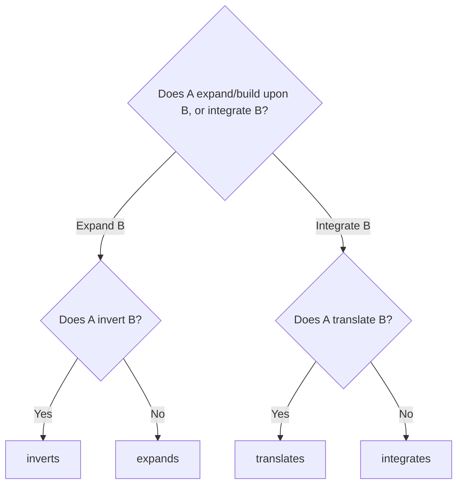

# Ontology Editing & Design Guidelines

This document translates the pedagogical and technological reasoning defined in [DESIGN.md](file:///c:/Users/silen/Documents/EduGraph/edugraph-ontology/DESIGN.md) into concrete, actionable instructions. It provides a shared set of rules and architectural constraints for developers and AI agents modifying, extending, or maintaining the EduGraph ontology.

---

## 1. Core Principles & Philosophy

When editing or extending the ontology, contributors must strictly adhere to the following four design decisions:

### 1.1 Dimensional Atomicity (The Intersectional Descriptor)
- **Rule:** Never define monolithic, compound, or text-heavy competency tags (e.g., do not create a single node named `IntegerAdditionWithCarrying`).
- **Implementation:** Break every skill down into its atomic, reusable dimensions:
  - **Area (Knowledge):** e.g., `IntegerAddition`
  - **Ability (Cognitive Skill):** e.g., `ProcedureExecution`
  - **Scope (Context/Constraints):** e.g., `CarryingRequired`
- **Reasoning:** Monolithic tags suffer from data starvation and sparse representation in machine learning. Atomic descriptors are highly reusable, allowing ML models to classify or generate embeddings for unseen competencies by evaluating their well-understood constituent descriptors.

### 1.2 Relational Determinism (The Logical Skeleton)
- **Rule:** Do not define subjective, fuzzy, or pedagogical "requires" relations.
- **Implementation:** Express prerequisites using only mathematically or compositionally objective progression properties (`expands`, `integrates`, `inverts`, `translates`).
- **Reasoning:** Statistical models (like LLMs) excel at prediction but lack causal guardrails. The progression relationships act as a deterministic skeleton (hard logical constraints) to prevent hallucinated learning paths in adaptive recommenders.

### 1.3 Cognitive Portability (The Fluid Dimension)
- **Rule:** Keep individuals of the `Ability` class strictly domain-general. 
- **Implementation:** An ability must not reference a specific subject matter. For example, `AnalyticalCapability` or `AnalogicalReasoning` are universal and must not be coupled to math-specific concepts.
- **Reasoning:** This allows a student's cognitive capabilities to be tracked as a single, fluid vector moving across multiple subjects (Math, Science, Language Arts), making it possible to identify whether a learning block is subject-specific or cognitive-processing related.

### 1.4 Latent Semantic Alignment (The Contextual Anchor)
- **Rule:** Choose clear, standard, and human-readable names for all entities.
- **Implementation:** Align terminology with generally accepted educational standards (e.g., Common Core nomenclature) rather than inventing proprietary jargon.
- **Reasoning:** EduGraph operates in tandem with large language models. Standard, descriptive terms anchor directly to the pre-trained latent space of LLMs, enabling high-performance zero-shot classification and hint generation.

---

## 2. Structural Classes & Constraints

All new entities must be instances of one of the subclasses of `CompetencyDescriptor` defined in [core-schema.ttl](file:///c:/Users/silen/Documents/EduGraph/edugraph-ontology/core-schema.ttl):

1. **`Ability`** ([core-abilities.ttl](file:///c:/Users/silen/Documents/EduGraph/edugraph-ontology/core-abilities.ttl))
   - Represents a domain-general cognitive skill.
   - *Example:* `AbductiveReasoning`, `ProcedureExecution`, `BiasDetection`.
2. **`Area`** ([core-areas-math.ttl](file:///c:/Users/silen/Documents/EduGraph/edugraph-ontology/core-areas-math.ttl))
   - Represents a specific domain of knowledge within a discipline.
   - *Example:* `IntegerMultiplication`, `AcuteAngle`.
3. **`Scope`** ([core-scopes-math.ttl](file:///c:/Users/silen/Documents/EduGraph/edugraph-ontology/core-scopes-math.ttl))
   - Represents the setting or constraints affecting difficulty.
   - *Example:* `NumbersLarger1000`, `AnalogClock`.
4. **`CompetencyDescription`** (or specialized `CompetencyEntity`)
   - Reusable intersections. Formed by establishing `involves` relationships pointing to at least one `Ability`, one `Area`, and one `Scope`.

---

## 3. Relational Mapping Rules

### 3.1 Taxonomic Relations (`partOf` / `hasPart`)
- Use `partOf` to organize descriptors hierarchically (e.g., `Addition partOf BaseOperations`).
- **Inheritance Rule:** Any entity that is `partOf` another inherits its structural and progression attributes. Ensure child classes specialize the parent class.

### 3.2 Progression Relations
When linking concepts, follow this decision tree to select the correct object property:

#### `expands` / `expandedBy`
- **When to use:** When the competency space grows from understanding B to understanding A. A represents a higher level of abstraction or space extension.
- *Example:* `Multiplication expands Addition` (moving from addition to scaling), `NumbersLarger10 expands NumbersSmaller10`.

#### `inverts` / `invertedBy` (Sub-property of `expands`)
- **When to use:** When A expands B and represents its logical inverse operation.
- **Directional Rule:** Though theoretically symmetric, assert the relation in the direction of intuitive learning sequence (usually forward before backward).
- *Example:* `Subtraction inverts Addition`, `Logarithm inverts Exponentiation`.

#### `integrates` / `integratedBy`
- **When to use:** When the capabilities formed in B are applied as component parts to synthesize the competency space of A.
- *Example:* `TheQuadraticFormula integrates Powers` and `integrates Fractions`.

#### `translates` / `translatedBy` (Sub-property of `integrates`)
- **When to use:** When A represents the same underlying concepts/problems as B, but from a different perspective, visualization, or notation.
- **Directional Rule:** Assert from the abstract/standard representation pointing to the concrete/visualized helper.
- *Example:* `FractionNotation translates Proportions`, `BaseTenBlock translates Base10`.

---

## 4. Execution Guidelines

When modifying, extending, or suggesting changes to this ontology:

1. **Verify Uniqueness:** Before adding or proposing a new individual, verify whether the concept can already be represented by intersecting existing descriptors (e.g., do not add a new `Area` if it can be defined by combining an existing `Area` and a `Scope`).
2. **Strict Acyclicity:** Ensure that taxonomy chains (`partOf`) and progression chains (`expands`, `integrates`) remain acyclic (contain no loops or cycles).
3. **Assert Bi-Directionality Cautiously:** Do not write duplicate statements for both directions of an inverse relationship (e.g., do not explicitly assert both `A expands B` and `B expandedBy A` or both `A hasPart B` and `B partOf A`). These are defined as `owl:inverseOf` in the schema; rely on reasoners to compute inverse assertions.
4. **Nomenclature and Annotations:**
   - Always write a concise, clean `rdfs:comment` containing concrete examples of the entity across different subjects where applicable.
   - Provide a clear `rdfs:isDefinedBy` description specifying the exact educational definition of the concept.
   - Use CamelCase syntax for individuals (e.g., `IntegerMultiplication`, `ProcedureExecution`).
