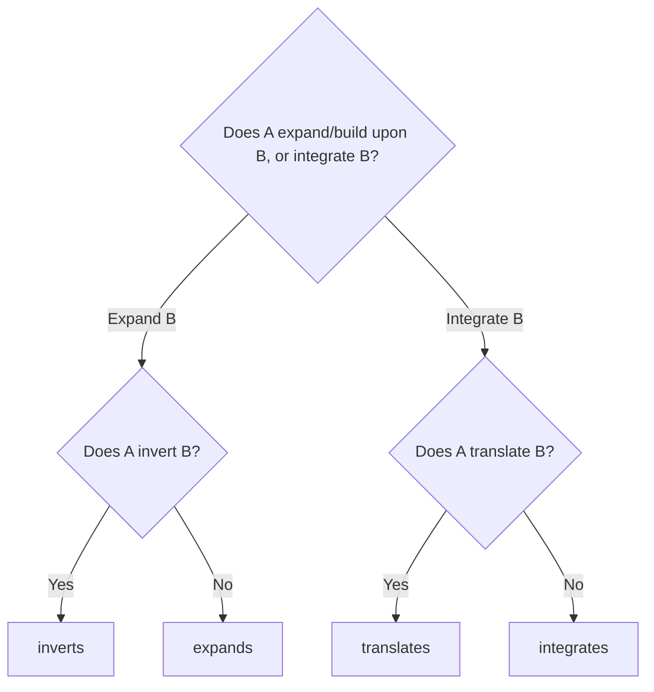

# Ontology Editing & Design Guidelines

This document is the authoring reference for descriptor definitions, dimension boundaries, and relation
semantics. [DESIGN.md](DESIGN.md) explains the reasoning; [DOCS.md](DOCS.md) documents the build
and client APIs. The Turtle schema and descriptor files are the machine-readable definitions.
A disagreement between those files and these rules requires an explicit review, not an inference
from existing usage.

---

## 1. Core Principles & Philosophy

When editing or extending the ontology, contributors must follow these design decisions:

### 1.1 Dimensional Atomicity (The Intersectional Descriptor)

- **Rule:** Never define monolithic, compound, or text-heavy competency tags (e.g., do not create a single node named `IntegerAdditionWithCarrying`).
- **Implementation:** Break every skill down into its atomic, reusable dimensions:
  - **Area (Knowledge):** e.g., `Addition`
  - **Ability (Cognitive Skill):** e.g., `ProcedureExecution`
  - **Scope (Context/Constraints):** e.g., `IntegerNumbers`, `NumbersSmaller20`
- **Reasoning:** Monolithic tags suffer from data starvation and sparse representation in machine learning. Atomic descriptors are highly reusable, allowing ML models to classify or generate embeddings for unseen competencies by evaluating their well-understood constituent descriptors.

### 1.2 Relational Determinism (The Logical Skeleton)

- **Rule:** Do not define subjective, fuzzy, or pedagogical "requires" relations.
- **Implementation:** Describe the intended conceptual dependency with `expands`, `integrates`,
  `inverts`, or `translates`. Keep capability substitution separate from progression inference.
- **Reasoning:** A typed relation makes a modeling claim inspectable. It does not by itself prove
  a learning prerequisite, mastery, or a causal effect. Progression coverage and inference rules
  remain a separate refinement task; existing edges do not establish the rule.

### 1.3 Cognitive Portability (The Fluid Dimension)

- **Rule:** Keep individuals of the `Ability` class strictly domain-general. 
- **Implementation:** An ability must not reference a specific subject matter. For example, `AnalyticalCapability` or `AnalogicalReasoning` are universal and must not be coupled to math-specific concepts.
- **Reasoning:** This allows a student's cognitive capabilities to be tracked as a single, fluid vector moving across multiple subjects (Math, Science, Language Arts), making it possible to identify whether a learning block is subject-specific or cognitive-processing related.

### 1.4 Latent Semantic Alignment (The Contextual Anchor)

- **Rule:** Choose clear, standard, and human-readable names for all entities.
- **Implementation:** Align terminology with generally accepted educational standards (e.g., Common Core nomenclature) rather than inventing proprietary jargon.
- **Reasoning:** EduGraph operates in tandem with large language models. Standard, descriptive terms anchor directly to the pre-trained latent space of LLMs, enabling high-performance zero-shot classification and hint generation.

---

## 2. Structural Classes & Constraints

Descriptor individuals belong to Area, Scope, or Ability. Competency descriptions combine those
descriptors through `involves`; they are a separate entity type in [core-schema.ttl](core-schema.ttl):

1. **`Ability`** ([core-abilities.ttl](core-abilities.ttl))
   - Represents a domain-general cognitive skill.
   - *Example:* `AbductiveReasoning`, `ProcedureExecution`, `BiasDetection`.
2. **`Area`** ([core-areas-math.ttl](core-areas-math.ttl))
   - Represents a specific domain of knowledge within a discipline.
   - *Example:* `Multiplication`, `AcuteAngle`.
3. **`Scope`** ([core-scopes-math.ttl](core-scopes-math.ttl))
   - Represents the observable context or constraints that shape a task's difficulty and available solution approaches.
   - *Example:* `NumbersLarger1000`, `AnalogClock`.
4. **`CompetencyDescription`** (or specialized `CompetencyEntity`)
   - Reusable intersections formed through `involves`: at least one Area and one Ability, with
     zero or more Scopes. Multiple descriptors in any dimension form a conjunction, not alternatives.
     There is no primary Ability. These are authoring rules, not a claim that the OWL schema
     enforces cardinality.

### 2.1 Area changes task nature; Scope changes task context

An Area identifies a task, relation, procedure, concept, or independently learned
body of knowledge. A Scope changes the context or challenge within that task. Combining Areas
can change what knowledge the task requires; adding Scopes describes how that task is situated.

For example, `MeasuringLength` and `MeasuringWeight` are independently learned activities.
`MeterScale` and `CentimeterScale` specify contexts for expressing a length. Likewise, knowing
how to work with circles does not establish knowledge of every geometric figure, so geometric
concepts belong in Area.

Use `FractionNotation`, `DecimalNotation`, and related Areas when notation itself is the
object of learning. Comparing numbers written as fractions does not establish knowledge of
fraction notation as an independent learning goal: describe the comparison Area and the
observable fraction Scope instead. Do not relabel an Area as Scope solely to simplify matching
or implementation reuse.

### 2.2 Observable claims and granularity

Read each definition in its dimension and family context. A Scope category describes a family
of contexts; its wording must not be reinterpreted as an Area or an Ability.

Choose the most specific defensible descriptor for the observable claim. Leaf status is not a
rule: `FractionNumbers` can itself describe the observed numeric context, and a measurement
scale family can be meaningful when that is the intended claim. An instrument category must
not substitute for an actual instrument solely because its members are linked by `partOf`.

Definitions must distinguish a concept from its neighbors using evidence in learning content.
Ability definitions must support both long-term tracking across subjects and reliable
classification of the performance demanded by an observable task. A task label describes that
demand; it does not prove that a learner possesses the Ability. Broad Abilities do not require
new leaves merely because they are frequent: add a specialization when its distinct observable
meaning is justified.

### 2.3 Content descriptions and implementation ownership

A standard target requests a conjunction of claims. An artifact description records the
observable result, including justified context that was not needed to identify the standard.
Every requested claim must be supported by an equal or specializing artifact claim; structural
ancestry alone provides no such support.

In the reference dataset, generators supply canonical mathematical data and views determine
the learner action and Ability claims. Area and Scope ownership follows the mathematical or
presentation decision that contributes them. Label mechanisms are dimension-neutral; this
separation of roles is an implementation contract, not a new ontology relation. Keep detailed
generator, view, and resolver rules in the content repository.

---

## 3. Relational Mapping Rules

### 3.1 Structural relations

| Relation | Meaning | Inverse |
| --- | --- | --- |
| `partOf` | A constituent belongs to a whole; the constituent does not inherit the whole's capability. | `hasPart` |
| `specializes` | A narrower form of the same concept inherits the broader capability. | `specializedBy` |
| `structures` | Common parent property for both structural relations; supports navigation through either. | `structuredBy` |

`partOf` and `specializes` are subproperties of `structures`. Their inverses are subproperties
of `structuredBy`. Assert the specific relation when its meaning is known; the shared parent
property does not identify which meaning applies.

For example, `Square specializes Rectangle` supports using a square capability to satisfy a
rectangle claim. `HalfCircle partOf Circle` records a component; it does not make a half circle
a kind of complete circle. `ProcedureInversion specializes ProcedureUnderstanding` expresses
inheritance, while `ErrorDetection partOf ErrorCorrection` expresses one stage of a process.

These relations connect descriptor individuals. `specializes` is not an OWL subclass assertion.

### 3.2 Ordered structure and specialization

Read a branch from its broad parent toward its descendants:

```text
field --hasPart*--> constituent --specializedBy*--> narrower form
```

A branch may use composition only, specialization only, or composition followed by specialization.
After specialization begins, it must not return to composition. In the authored child-to-parent
direction, the equivalent path is `specializes* -> partOf*`; stating the direction matters.

Review a parent with both constituent and specializing children as a modeling defect: separate
the structural grouping from the capability being specialized. Do not add a permanent exception
to preserve an existing placement. Review every path through a node with multiple parents;
the ordering rule does not by itself impose a single-parent tree.

Read parent and child definitions together before classifying an edge. A component, stage,
instrument, or aspect can remain a true part all the way to a leaf. Names and depth alone
cannot establish specialization.

### 3.3 Capability inheritance and other inference

For capability substitution, follow `specializes` only, including its transitive closure.
Neither `partOf` nor the combined `structures` closure proves that a constituent satisfies a
claim about its whole.

Other inference requires its own rules. A part-whole relation can be relevant to a justified
progression inference without making the part a specialization. The schema describes
`specializes` as inheritance of attributes and relations, but the exact transfer of
`expands` or `integrates` across source and destination hierarchies still requires refinement.
Do not infer blanket propagation, or a blanket ban on structural inference, from the matching rule.
The same applies when deriving relations between competencies through `involves`.

Keep three operations distinct: following recorded graph edges, materializing schema-declared
inverses and superproperties, and applying a semantic inference rule. The client APIs provide the
first two; their transitive helpers are not a general rule engine.

### 3.4 Progression Relations

Use this decision tree to describe the intended direct relation. It is an authoring aid, not a
complete inference algorithm or proof of a universal teaching sequence:


```mermaid
graph TD
    Q1{Does A expand/build upon B, or integrate B?}
    Q1 -->|Expand B| Q2{Does A invert B?}
    Q1 -->|Integrate B| Q3{Does A translate B?}
    
    Q2 -->|Yes| R_inverts[inverts]
    Q2 -->|No| R_expands[expands]
    
    Q3 -->|Yes| R_translates[translates]
    Q3 -->|No| R_integrates[integrates]
```

#### `expands` / `expandedBy`

- **When to use:** When the competency space grows from understanding B to understanding A. A represents a higher level of abstraction or space extension.
- *Example:* `Multiplication expands Addition` (moving from addition to scaling), `NumbersLarger10 expands NumbersSmaller10`.

#### `inverts` / `invertedBy` (Sub-property of `expands`)

- **When to use:** When A expands B and represents its logical inverse operation.
- **Directional Rule:** Though theoretically symmetric, assert the relation in the direction of intuitive learning sequence (usually forward before backward).
- *Example:* `Subtraction inverts Addition`, `Logarithm inverts Exponentiation`.

#### `integrates` / `integratedBy`

- **When to use:** When the capabilities formed in B are applied as component parts to synthesize the competency space of A.
- *Example:* `Multiplication integrates Iteration`.

#### `translates` / `translatedBy` (Sub-property of `integrates`)

- **When to use:** When A represents the same underlying concepts/problems as B, but from a different perspective, visualization, or notation.
- **Direction:** Preserve the direction of the asserted representation relation. The inverse
  property provides reverse access; it does not establish a universal teaching order from concrete
  to abstract or the reverse.
- *Example:* `BaseTenBlocks translates Base10`.

---

## 4. Execution Guidelines

When modifying, extending, or suggesting changes to this ontology:

1. **Verify Uniqueness:** Before adding or proposing a new individual, verify whether the concept can already be represented by intersecting existing descriptors (e.g., do not add a new `Area` if it can be defined by combining an existing `Area` and a `Scope`).
2. **Structural Review:** Check acyclicity, the ordering rule in section 3.2, and every path through
   multiple parents. Retain the existing acyclicity requirement for progression chains.
   These are review obligations; do not describe them as universally automated checks.
   A centralized validation module is a separate task, with its rule coverage made explicit.
3. **Assert Bi-Directionality Cautiously:** Do not write duplicate statements for both directions of an inverse relationship (e.g., do not explicitly assert both `A expands B` and `B expandedBy A` or both `A hasPart B` and `B partOf A`). These are defined as `owl:inverseOf` in the schema; rely on reasoners to compute inverse assertions.
4. **Nomenclature and Annotations:**
   - Always write a concise, clean `rdfs:comment` containing concrete examples of the entity across different subjects where applicable.
   - Provide a clear `rdfs:isDefinedBy` description specifying the exact educational definition of the concept.
   - Use CamelCase syntax for individuals (e.g., `Multiplication`, `ProcedureExecution`).

### Review order

1. Establish the observable claim and distinguish Area, Scope, and Ability.
2. Read neighboring definitions and identify duplication, missing distinctions, or incorrect placement.
3. Classify each structural edge by its meaning and check every resulting path.
4. Check affected capability matches using specialization alone.
5. Review progression assertions separately; record unresolved inference questions explicitly.
6. Validate affected content and definitions together. Classification failures can indicate a
   definition, annotation, rendering, or model problem; identify the cause before changing labels.
7. Use the build and verification workflow in [DOCS.md](DOCS.md). Documentation-only changes need
   link and semantic consistency review; source or generator changes need the relevant build tests.
